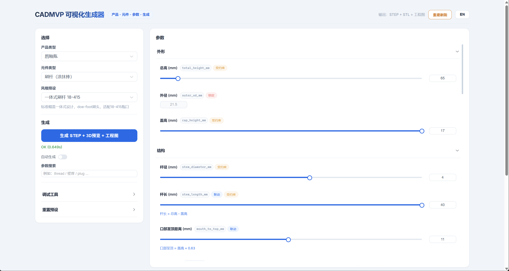
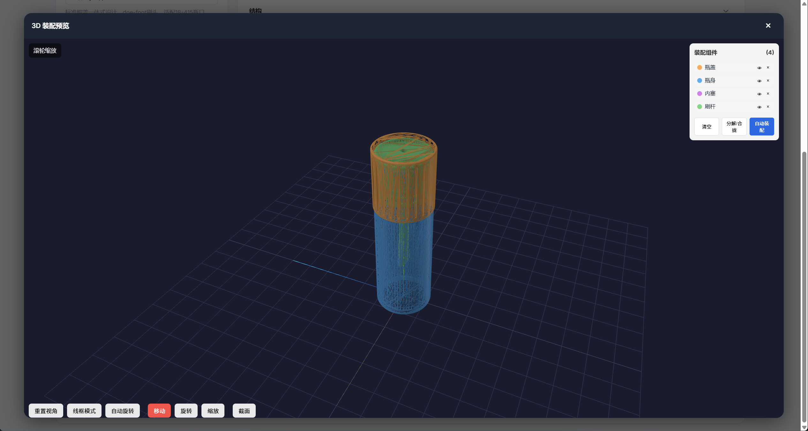
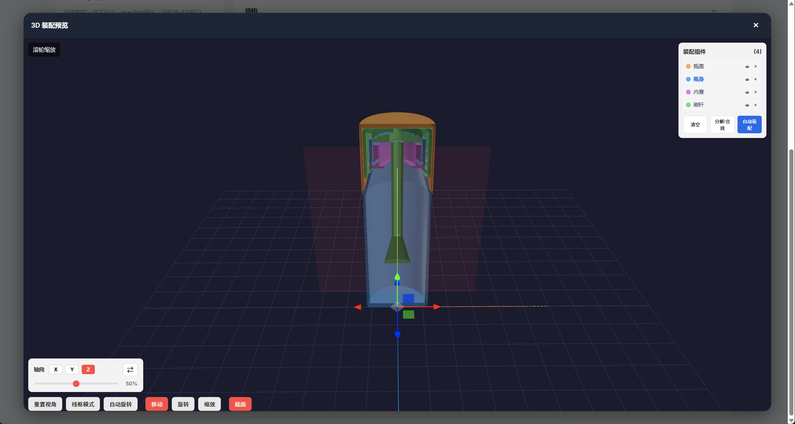
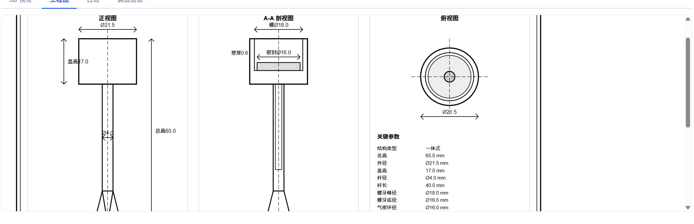

# AiCad - Parametric CAD Generator for Cosmetic Packaging

> Parametric CAD system for lip gloss bottle assemblies — from parameters to manufacturing-ready STEP files in seconds.

[中文](#中文说明) | [English](#overview)

---

## Overview

AiCad is a web-based parametric CAD generation platform designed for cosmetic packaging engineers. It generates complete lip gloss bottle assemblies (Cap, Bottle, Wiper, Wand) with manufacturing-grade precision, outputting **STEP**, **STL**, and **engineering drawings (SVG)**.

**Core value**: Instead of manually modeling in SolidWorks/Fusion360, engineers adjust parameters through a visual interface and get production-ready CAD files with proper threads, seals, and assembly fit — all auto-validated.

### Main Interface



*Parameter panel with core/derived parameter system. Derived parameters (marked "联动") auto-compute from core values. Cross-component constraints (marked "受约束") ensure assembly compatibility.*

---

## Features

### Parametric 4-Component Assembly

Generate complete lip gloss bottle assemblies with intelligent parameter management:

- **Cap** (瓶盖): Outer shell, grip texture (ribs/knurl), dome/flat top, inner cavity + threads
- **Bottle** (瓶身): Body/shoulder/neck sections, external threads, inner cavity, bottom treatment
- **Wiper** (内塞): Sealing diaphragm, central orifice, reinforcement ribs, flange
- **Wand** (刷杆): Applicator cap + stem + brush head (doe-foot/spatula/fiber), seal ring

### 3D Assembly Viewer

Interactive Three.js viewer with full assembly visualization:



*Four-component assembly in wireframe mode — threads, grip textures, and internal structures visible.*

### Cross-Section View

Inspect internal fit and clearances with the built-in section tool:



*Cross-section reveals internal structure: thread engagement, seal ring positioning, wand-to-cap clearance.*

### Engineering Drawings

Auto-generated SVG engineering drawings with manufacturing dimensions:



*Front view, A-A cross-section, and top view with all critical dimensions annotated.*

---

## Technical Highlights

| Feature | Description |
|---------|-------------|
| **Core/Derived Parameters** | Core params are user-controlled; derived params auto-compute (e.g., inner diameter = outer diameter - 1.6mm) |
| **Cross-Component Constraints** | Generating one component constrains others (e.g., cap generation locks wand outer diameter) |
| **Priority-Based Resolution** | Constraint conflicts resolved by priority: Cap(20) > Bottle(15) > Wand(10) > Wiper(5) |
| **10-Point QC Validation** | Assembly interference detection, dimensional checks, and manufacturing feasibility |
| **Manufacturing Awareness** | Minimum draft angles (0.3-0.5°), wall thickness (0.8mm), thread profiles with configurable pitch |
| **Graceful Degradation** | Non-critical decorative features degrade gracefully; critical geometry fails hard |
| **Bilingual UI** | Full Chinese/English interface with runtime language switching |

---

## Tech Stack

| Layer | Technology |
|-------|-----------|
| **CAD Engine** | Python 3.11 + CadQuery 2.6.1 (OpenCASCADE kernel) |
| **Web Server** | aiohttp (async HTTP, port 8010) |
| **Frontend** | Vue 3 + TypeScript + Pinia + Element Plus |
| **3D Viewer** | Three.js 0.160.0 with TransformControls |
| **Build Tool** | Vite 6.3 |
| **Output Formats** | STEP, STL, SVG |

---

## Quick Start

### Prerequisites

- Python 3.11+ (Conda recommended)
- Node.js 18+

### Setup

```bash
# 1. Create conda environment
conda create -n AiCad python=3.11 -y
conda activate AiCad

# 2. Install Python dependencies
pip install cadquery==2.6.1 aiohttp numpy ezdxf matplotlib

# 3. Install frontend dependencies
cd web && npm install && cd ..

# 4. Build frontend
cd web && npm run build && cd ..

# 5. Start server
python scripts/web_server.py
```

Open http://localhost:8010 in your browser.

### Usage

1. Select **product** (Lip Gloss) and **component** (Cap/Bottle/Wiper/Wand)
2. Choose a **preset** or adjust parameters manually
3. Click **"Generate STEP + 3D Preview + Engineering Drawing"**
4. Download STEP/STL files or view 3D preview and engineering drawings
5. Generate all 4 components to see full assembly with interference checks

---

## Project Structure

```
AiCad/
├── src/
│   ├── core/                        # Core engine
│   │   ├── modeler.py               # CadQuery geometry builder (1100+ lines)
│   │   ├── param_system.py          # Parameter classification framework
│   │   ├── fit_constraints.py       # Assembly constraint system
│   │   ├── component_state.py       # Cross-component state manager
│   │   ├── interpreter.py           # Parameter validation & normalization
│   │   └── assembly.py              # Assembly positioning & QC
│   └── products/
│       └── lip_gloss/
│           ├── components/          # Cap, Bottle, Wiper, Wand definitions
│           ├── constraints.py       # Fit constraint rules
│           ├── derived_params.py    # Derivation & cross-component rules
│           └── drawings/            # SVG engineering drawing generators
├── web/
│   └── src/
│       ├── components/              # Vue components (viewer, params, layout)
│       ├── stores/                  # Pinia state management
│       ├── api/                     # Backend API client
│       ├── i18n/                    # Chinese/English translations
│       └── composables/             # Reusable logic hooks
├── scripts/
│   ├── web_server.py                # HTTP server entry point
│   └── generate.py                  # CLI generation tool
├── tests/                           # Test suite
└── docs/                            # Documentation & screenshots
```

---

## API Endpoints

| Method | Endpoint | Description |
|--------|----------|-------------|
| GET | `/api/schema` | Product/component/preset definitions |
| GET | `/api/derived_rules` | Derivation rule metadata |
| POST | `/api/generate` | Generate component (returns STEP/STL/SVG URLs + QC) |
| GET | `/api/assembly` | Assembly positions + interference report |
| GET | `/api/constraints/{comp}` | Cross-component constraints |
| POST | `/api/generated/{comp}` | Store generated component state |

---

## License

Private project. All rights reserved.

---

<a id="中文说明"></a>

## 中文说明

AiCad 是一个面向化妆品包装工程师的参数化 CAD 生成平台。当前支持唇釉瓶（瓶盖、瓶身、内塞、刷杆）四组件装配体的自动生成。

### 核心能力

- **参数驱动**：调参即出图，无需手动建模
- **智能约束**：核心参数/派生参数自动联动，跨组件配合约束自动传递
- **制造级精度**：螺纹、密封环、壁厚、拔模角均满足注塑生产要求
- **质量检查**：10项装配验收标准，自动检测干涉和尺寸异常
- **多格式输出**：STEP（可编辑工程文件）+ STL（3D打印）+ SVG（工程图）

### 快速开始

```bash
conda activate AiCad
python scripts/web_server.py
# 浏览器打开 http://localhost:8010
```
